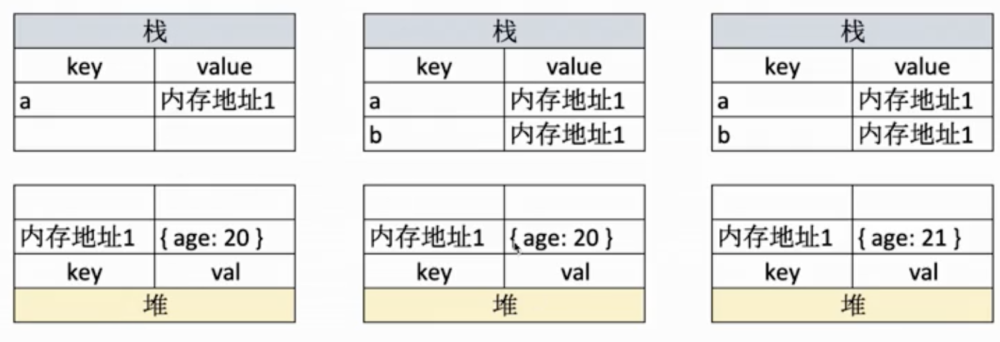

# 数据类型

## 值类型

- let a;//underfind (const的定义的常量必须有初始值)
- const a = '' //string
- const a= 1 //number
- const a = true //boolean
- const a = Symbal('s')
## 引用类型
- 数组
- 对象
- null

```
let a = 100
let b = a
a =200
console.log(b) // 100
```
值在栈中存储。


```
let a = {age:20}
let b = a
a.age = 21
console.log(b) // {age:21}
```

引用类型，变量在栈中存储，对应的值存储的是引用地址，引用的值存储在堆中。
值在栈中存储。


## 为什么设计引用类型？

  性能和存储的问题，值类型占用空间小，可以存在栈中。引用类型数据大，存在栈中不好管理。如果复制栈中的对象会很慢。

## typeof运算符
可以判断的类型 可以识别所有值类型
underfind string number boolean symbal 
判断函数
typeof funcation a(){}  // function 


## 深拷贝实现
```
function deepClone(json = {}) {
    if(typeof  json !== 'object'||json == null){
        return json;
    }
    let result;
    if(json instanceof Array){
        result = []
    }else{
        result = {}
    }
    for(let key in json){
        //保证key是json自身的属性
        if(json.hasOwnProperty(key)){
            result[key] = deepClone(json[key])
        }
    }

    return  result;
}

```
## instanceof实现
寻找左边的对象的原型链中是否存在右边对象的原型对象。
```
function instanceof(left,right) {
    let l = left.__proto__;
    let r = right.prototype;
    while (true){
        if(l === null){
            return false;
        }
        if(l === r){
            return  true;
        }
        l = r.__proto__;
    }

}
```