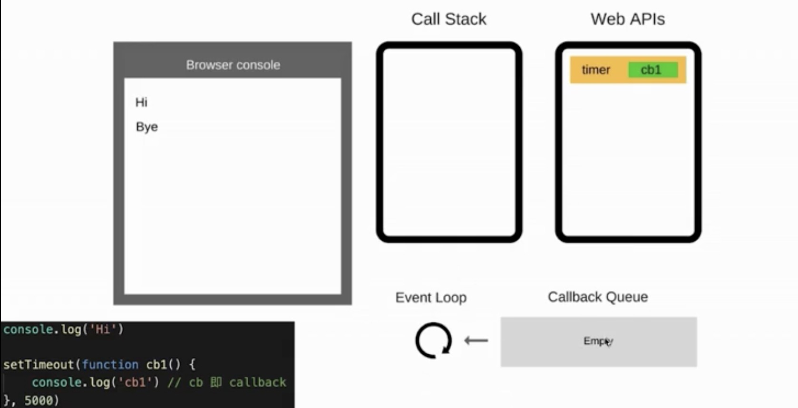

# 事件循环 

## event-loop是什么？
js是单线程，异步是基于回调实现的，Event-loop是异步回调的实现原理。

## 事件循环的过程



```$xslt
console.log('111')
setTimeOut(function){ console.log('333') },1000)
console.log('222')
```

- 同步代码一行行执行放在Call Stack中
- 如果遇到异步，会先记录。时机到了把回调函数放在 callback queue中。
    （遇到setTimeOut，是浏览器的API，在webAPI中设置定时器，到达定时器时间把回调函数放入callback queue中）

- 如果 Call Stack为空（同步代码执行完）Event-loop开始工作 
- 轮询查找 callback queue，如果有则移动到 call statck中执行
- 然后继续轮询查找

## DOM事件
  DOM事件，js执行到DOM事件如click,事件是WebAPI，当用户点击时，把回调函数挂到callback Queue中(但DOM事件不是异步，只是通过Event-loop来实现。)


## 为什么JavaScript是单线程？

作为浏览器的脚本语言，js主要用途是和用户交互和操作DOM。（如果js一个线程操作DOM，一个线程删除DOM。会带来同步的问题）

为了利用多核计算能力,HTML5提出Web Woker标准允许js创建多线程，但是子进程完全受控于主线程，且不得操作DOM，（并没有改变js单线程的本质）

## 任务队列

主线程：主线程上执行所有的同步任务，主线成的这些同步任务形成一个执行栈。
任务队列：任务队列是一个事件的队列，

   （所有的事件都是通过回调实现，都是需要放在异步队列中执行（需要指定回调函数，等待主线程清空队列读取异步队列内容），setTimeOut也是在异步队列中执行，可以通过setTimeOut来模拟异步。）
    
## setTimeOut(fn,0)的含义
setTimeout(fn,0)的含义是，指定某个任务在主线程最早可得的空闲时间执行，也就是说，尽可能早得执行。它在"任务队列"的尾部添加一个事件，因此要等到同步任务和"任务队列"现有的事件都处理完，才会得到执行。
HTML5 setTimeout第二个参数最小值不能低于4ms，对于DOM的变动（涉及页面重新渲染的那部分），通常不会立即执行，而是每16ms执行一次。 
所以此时使用requestAnimationFrame（）的效果要好于setTimeOut（）.
setTimeOut()只是把事件插入到任务队列中，必须等到当前代码主线程执行栈执行完，和异步队列现有任务都执行完，才会执行setTimeOut。

## Node.js的事件循环 

### process.nextTick方法
在当前"执行栈"的尾部----下一次Event Loop（主线程读取"任务队列"）之前----触发回调函数。指定的任务总是发生在所有异步任务之前。
```$xslt
    `process.nextTick(function A() {
      console.log(1);
      process.nextTick(function B(){console.log(2);});
    });
    
    setTimeout(function timeout() {
      console.log('TIMEOUT FIRED');
    }, 0)
    // 1
    // 2
    // TIMEOUT FIRED`
```
### setImmediate()方法
在当前"任务队列"的尾部添加事件，也就是说，它指定的任务总是在下一次Event Loop时执行，这与setTimeout(fn, 0)很像。
```$xslt
setImmediate(function A() {
  console.log(1);
  setImmediate(function B(){console.log(2);});
});

setTimeout(function timeout() {
  console.log('TIMEOUT FIRED');
}, 0);
```
setImmediate与setTimeout(fn,0)各自添加了一个回调函数A和timeout，都是在下一次Event Loop触发。那么，哪个回调函数先执行呢？答案是不确定。运行结果可能是1--TIMEOUT FIRED--2，也可能是TIMEOUT FIRED--1--2。

### 宏任务和微任务
- 宏任务： setTimeOut setInterval Ajax DOM事件
- 微任务： Promise Async/await
- 宏任务在DOM渲染后触发，如setTimeOut
- 微任务在DOM渲染前面触发


```
//现象 利用alert可以阻塞DOM渲染，观察现象
先打印11，此时DOM还没有渲染。
在打印222，此时页面上已经显示三个插入的p标签
const p1 = $('<p>111</p>')
const p2 = $('<p>222</p>')
const p3 = $('<p>333</p>')
('#container').append('p1').append('p2').append('p3')

Promise.resolve().then(()=>{
  $('#container').children().length //打印3
  alert('11')//打印111 
})

setTimeOut(()=>{
  console.log('222')
})
```

## 在事件机制中宏任务，微任务执行的过程

- 1 callStack清空 同步代码执行完
- 2 执行微任务队列 micro task queue
- 3 尝试DOM渲染 
- 4 触发Event-loop
- 5 callbackQueue异步队列事件执行， 宏任务