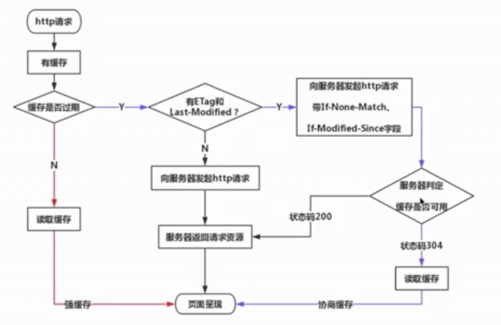

# 缓存

## 强制缓存

### 强缓存过程
- 1 初次请求，后端 返回资源 和Cache-Control
    Cache-Control: max-age=315360000
- 2 再次请求，判断是否Cache-Control
- 3 如果缓存失效，重新返回Cache-Control

### Cache-Control
Cache-Control === Expires，Expires已经被Cache-Control取代了。
- 1 max-age过期时间
- 2 no-cache不用强制缓存,服务端怎么处理缓存不管。
- 3 no-store不用本地缓存，并且不让服务端做缓存。

## 协商缓存

服务端缓存策略，服务端判断是否需要缓存。

服务端判断客户端资源，是否和服务端资源一样。一致返回304，否则返回200和最新资源。

### 协商过程 
- 1客户端初次请求，服务端返回 资源 和Last-modified或者Etag
- 2再次请求Request Headers中携带 if-Modified-Since：客户端缓存起来的时间 （Last-modified） 或者 if-None-Match:浏览器缓存的etag
- 3返回304或者，返回资源和新的Last-modified 或者新的Tag

### Etag比if-Modified-Since的优势？

Etag指纹，由服务端生成，通过Etag比较文件是否需要缓存，在高精度下更准确。
某些文件修改非常频繁，比如在秒以下的时间内进行修改，(比方说1s内修改了N次)，If-Modified-Since能检查到的粒度是s级的，这种修改无法判断(或者说UNIX记录MTIME只能精确到秒)。

### 计算整个文件得到etag会耗费性能，怎么解决？

Etag分为强Etag 和 若 Etag是根据服务器配置文件生成的。
一些文件

### 协商缓存资源标识
- Last-Modified资源的最后修改时间
- Etag资源唯一标识（字符串类似指纹）

浏览器缓存了解吗？强缓存一般存放在哪里？计算整个文件得到etag会耗费性能，怎么解决？
如果我不想要使用缓存了，每次都请求最新的，怎么做？no-store和no-cache的区别是什么？
浏览器缓存说一下？
301、302、403的含义

## 浏览器缓存过程图解

